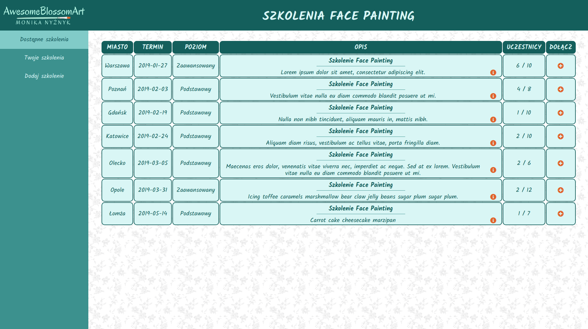
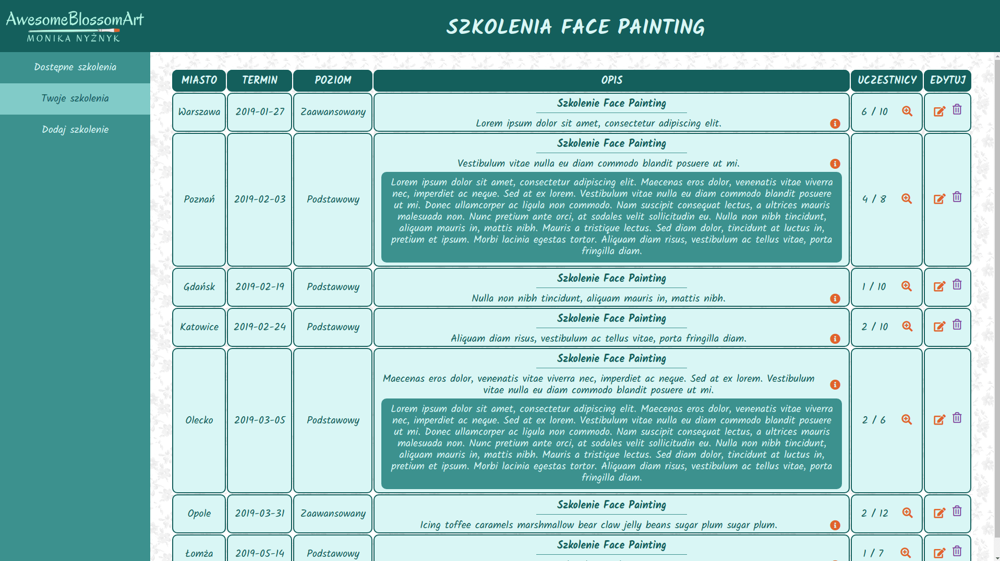
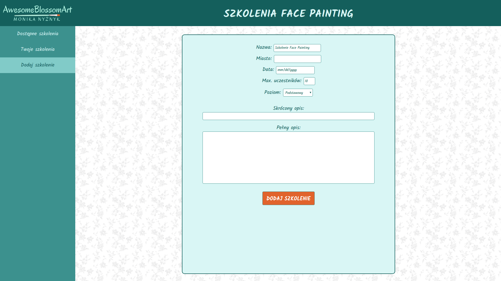
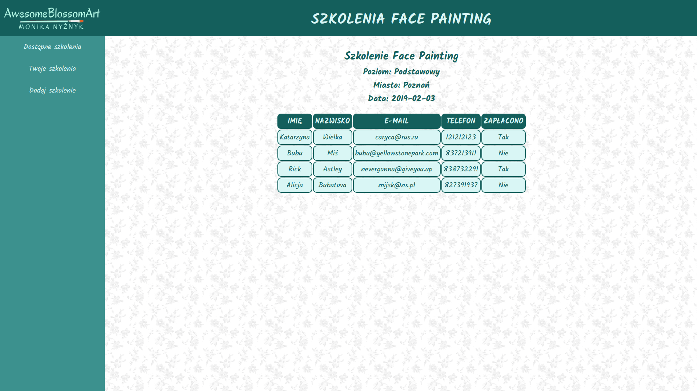

# AwesomeBlossomArt Event App

Own project (work in progress).

The app was first created as final project witihn Coder's Lab "JavaScript Developer: React" course.

The aim of the project was to create a web app for face painting artist who organizes trainings for other face painters. The app was meant to have following functionalities:
* adding new events (organizer)
* setting up attendee number limits (organizer)
* displaying added events list (organizer)
* editing events (organizer)
* deleting events (organizer)
* displaying available events list (attendee)
* registering for event (attendee)
* viewing list of registered attendees (organizer)

The app consists of 3 tabs:
* Available events (for potential attendees)
* My events (for organizer)
* Add event (for organizer)

Technologies used:
* JS.React
* HTML
* Sass
* Webpack

Next steps in project's development:

* adding authentication for organizer, so that My events and Add event tabs are only visible after logging in
* modifying registering form to include required information (eg. invoice data, etc)
* modifying event adding form to include more information (eg. event exact location, map, etc)
* adding RWD
* adding e-mail notifications
* adding landing page
* adjust stying to fit organizer's needs

Preview:

https://nyziek.pl/projects/awesomeblossomart/build/

Screenshots:

Project was set up using Create React App (https://github.com/facebook/create-react-app).
